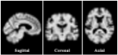

# Kazumichi Ota

Neurologist and neuroimaging researcher.

Research interests include age-appropriate anatomical standard spaces,
brain MRI registration, stroke neuroimaging, and reproducible neuroimaging methods.

  

## Projects

- [Elderly Brain Template (EBT)](https://github.com/KazumichiOta/elderly-brain-template)
- [EBT–MNI152 Stroke Standard-Space Comparison](https://github.com/KazumichiOta/ebt-mni152-stroke-standardspace)

## Links

- [ORCID](https://orcid.org/0000-0002-5440-4663)
